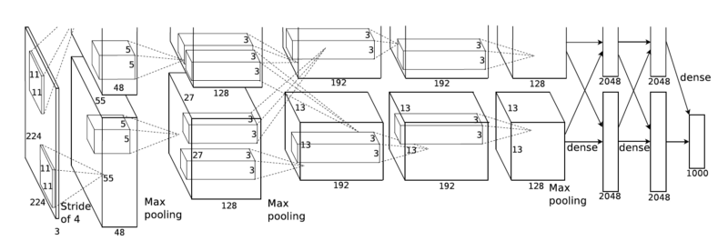

# AlexNet-PyTorch
This repository contains implementation of [AlexNet](https://papers.nips.cc/paper/4824-imagenet-classification-with-deep-convolutional-neural-networks.pdf)
(ImageNet Classification with Deep Convolutional Neural Networks) by PyTorch and the network tested with the
[CIFAR-10 dataset](https://www.cs.toronto.edu/~kriz/cifar.html).



# Download the CIFAR-10 dataset
Before training and testing the network, you should download the following dataset:

* CIFAR-10 Dataset: https://www.cs.toronto.edu/~kriz/cifar-10-python.tar.gz

When the download is finished, extract the `cifar-10-python.tar.gz` file.

# Training on CIFAR-10 dataset
To train the network on the CIFAR-10 dataset, type the following command at the command prompt:
```
python3 ./train.py
```

Sample images from CIFAR-10 dataset:


## Results

### Epoch 0
```
Validate Accuracy = 0.100
```

### Epoch 1
```
Validate Accuracy = 0.203
```

### Epoch 2
```
Validate Accuracy = 0.302
```

...

### Epoch 40
```
Validate Accuracy = 0.684
```

...

### Epoch 50
```
Validate Accuracy = 0.744
```

# Evaluating on CIFAR-10 dataset
To evaluate the network on the CIFAR-10 dataset, type the following command at the command prompt:
```
python3 ./evaluate.py
```

## Test Result
```
Test Accuracy = 0.754
```

# Dependencies
* Python 3
* numpy
* scipy
* pillow
* pytorch

# Links
* https://papers.nips.cc/paper/4824-imagenet-classification-with-deep-convolutional-neural-networks.pdf
* https://www.cs.toronto.edu/~kriz/cifar.html
* https://github.com/FanHuang1008/AlexNet-PyTorch
